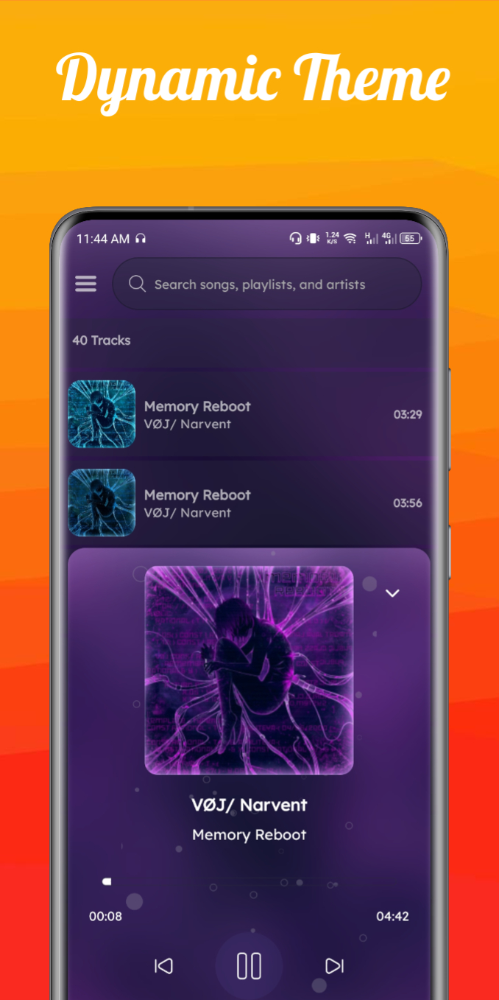
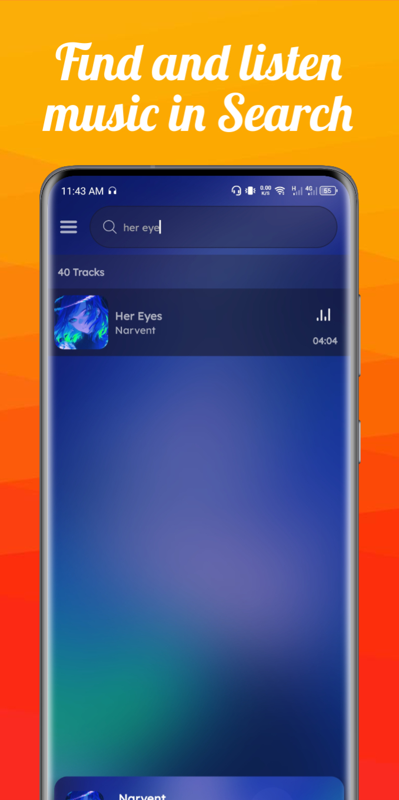

# Sonara

**Sonara** is an offline music player app designed for music lovers who want to enjoy their music library without relying on an internet connection. With a sleek design and user-friendly features, Sonara brings a seamless experience to manage, play, and explore your music collection.

## Features

- **Play Music Offline**: Enjoy your music library without internet access.
- **Custom Playlists**: Create, manage, and play personalized playlists.
- **Song Search**: Quickly search and find songs by title, artist, or album.
- **Background Playback**: Continue enjoying music while using other apps.
- **Equalizer**: Customize your listening experience with an in-app equalizer.
- **Favorites**: Mark songs as favorites for quick access.
- **Intuitive UI**: Easy-to-navigate interface with album art display.

## Screenshots

 <!-- Replace with actual image path -->
 <!-- Replace with actual image path -->
 <!-- Replace with actual image path -->

## Installation

1. Clone the repository:
   ```bash
   git clone https://github.com/MuneebAbro/Sonara.git
   cd Sonara
